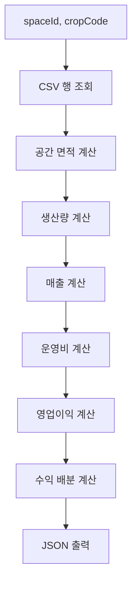

# Profit Calculator 계산 명세 PRD

작성 기준: `Profit-Calculator-java`의 Java 계산 코드와 `src/main/resources/data/*.csv`  
문서 목적: 현재 Java Profit Calculator가 입력 CSV를 읽어 월평균 수익성 JSON을 만드는 계산 순서와 계산식을 설명한다.  
검증 기준: 문서 작성 전 `mvn test` 1회 실행 결과를 기록한다.

## 1. 시스템 목적

Profit Calculator는 유휴 공간 또는 소형 재배 공간에 특정 작물을 재배한다고 가정하고, 공간 규모, 생산량, 매출, 전기·수도·재료·인건·유통·감가상각 비용, 영업이익, 수익 배분을 월평균 기준으로 계산한다.

현재 구현의 최종 출력 단위는 JSON이며, 핵심 기간 표기는 `AVERAGE_MONTHLY_FROM_ANNUAL_SCENARIO`이다. 전기 사용량은 월별 달력 및 계절 조건을 모두 계산한 뒤 연간 값을 12개월로 나누어 평균 월 값을 만든다.

## 2. 입력 데이터

Java 진입점은 `ProfitabilityService.buildResult(int spaceId, String cropCode)`이다. 이 메서드는 다음 CSV에서 필요한 행을 조회한다.

- `spaces.csv`: 공간 면적, 재배 가능 비율, 랙 단수
- `crops.csv`: 작물 생산 단위, 수확량, 회전수, 판매 가능 비율, 목표 온습도, 조명, 관수, 증산량
- `sales.csv`: 가격 기준, 가격, 판매율, 유통비율, 플랫폼 수수료율
- `crop_materials.csv`: 작물별 재료 항목, 수량 기준, 단가, 손실률
- `packaging.csv`: 작물·판매 채널별 포장 단위와 포장 비용
- `profit_sharing.csv`: 공간 제공자와 본사 배분율
- `environment_standards.csv`: 체적, 열부하, 공기·물성, 단위 변환 상수
- `equipment_standards.csv`: 냉난방 COP, LED 효율, 조명 열전환, 가습·제습, 보조 전력
- `utility_rates.csv`: 전기 요금, 수도 요금, 최저임금
- `operating_policies.csv`: 월/년 기준, 인건비, 청소수, 감가상각 기준, 계약전력 안전계수
- `seasonal_conditions.csv`: 계절별 외기 온도와 상대습도
- `calendar_profiles.csv`: 1월부터 12월까지의 일수, 기후 계절, 전기요금 계절
- `operating_costs.csv`: 현재 Java 계산 경로에서는 직접 사용되지 않음

## 3. 전체 계산 순서



상세 순서는 다음과 같다.

1. `spaces.csv`, `crops.csv`, `sales.csv`, `crop_materials.csv`, `packaging.csv`, `profit_sharing.csv`에서 행을 조회한다.
2. 바닥 사용 가능 면적과 재배면적을 계산한다.
3. 작물별 월 총생산량과 판매 가능 생산량을 계산한다.
4. 판매율과 가격 기준으로 예상 판매량과 예상 매출을 계산한다.
5. 에너지, 용수, 인건비, 재료비, 포장비, 유통비, 감가상각을 계산한다.
6. 감가상각 전 운영비와 감가상각 후 총 예상 비용을 계산한다.
7. 예상 매출에서 감가상각 전 운영비를 차감해 영업이익을 계산한다.
8. 이익이 양수이면 배분율대로 나누고, 이익이 0 이하이면 배분액은 0으로 두고 손실을 `undistributedLoss`에 기록한다.
9. 계산값을 6자리 소수 기준으로 정규화해 JSON으로 출력한다.

## 4. 공간 면적 및 체적 계산

### 공간 면적 및 체적 계산

- 목적: 전체 바닥면적에서 실제 재배 가능한 면적과 랙 단수를 반영한 재배면적, 공간 체적을 계산한다.
- 입력값: `total_area_m2`, `cultivable_ratio`, `rack_layers`, `DEFAULT_CEILING_HEIGHT_M`
- 계산식:
  - `usable_floor_area_m2 = total_area_m2 * cultivable_ratio`
  - `cultivation_area_m2 = usable_floor_area_m2 * rack_layers`
  - `space_volume_m3 = total_area_m2 * DEFAULT_CEILING_HEIGHT_M`
- 변수와 단위:
  - `total_area_m2`: m2
  - `cultivable_ratio`: 0 이상 1 이하 비율
  - `rack_layers`: 단
  - `DEFAULT_CEILING_HEIGHT_M`: m
  - `space_volume_m3`: m3
- 계산 순서: 바닥 사용 가능 면적 계산 → 랙 단수 반영 재배면적 계산 → 전체 면적에 기본 천장고를 곱해 체적 계산
- 관련 Java 클래스 또는 메서드: `ProfitabilityService.calculateCultivationScale`, `ProfitabilityService.calculateSpaceVolume`
- 관련 CSV: `spaces.csv`, `environment_standards.csv`

## 5. 생산량 계산

### 생산량 계산

- 목적: 재배면적, 단위면적당 수확량, 월 회전수로 월 생산량을 산출한다.
- 입력값: `cultivation_area_m2`, `yield_per_m2_per_cycle`, `cycles_per_month`, `marketable_ratio`, `production_unit`
- 계산식:
  - `gross_quantity = cultivation_area_m2 * yield_per_m2_per_cycle * cycles_per_month`
  - `marketable_quantity = gross_quantity * marketable_ratio`
  - `production_unit`이 `kg`이면 `gross_yield_kg = gross_quantity`, `marketable_yield_kg = marketable_quantity`
- 변수와 단위:
  - `yield_per_m2_per_cycle`: 생산 단위/m2/cycle
  - `cycles_per_month`: cycle/month
  - `gross_quantity`, `marketable_quantity`: `kg`, `ea`, `root` 중 CSV의 `production_unit`
- 계산 순서: 총생산량 계산 → 판매 가능 비율 적용 → kg 작물인 경우 kg 출력 필드도 채움
- 관련 Java 클래스 또는 메서드: `ProfitabilityService.calculateMonthlyProduction`
- 관련 CSV: `crops.csv`

## 6. 매출 계산

### 매출 계산

- 목적: 판매 가능 생산량에 판매율과 단가를 적용해 예상 매출을 계산한다.
- 입력값: `marketable_quantity`, `quantity_unit`, `sales_rate`, `price_basis`, `price_krw`, `package_quantity`, `sales_unit`
- 계산식:
  - `PER_PACKAGE`이면 `unit_price_krw = price_krw / package_quantity`
  - `PER_KG`, `PER_UNIT`, `PER_ROOT`이면 `unit_price_krw = price_krw`
  - `expected_sales_quantity = marketable_quantity * sales_rate`
  - `expected_revenue = expected_sales_quantity * unit_price_krw`
- 변수와 단위:
  - `sales_rate`: 0 이상 1 이하 비율
  - `price_krw`: KRW
  - `unit_price_krw`: KRW/unit
  - `expected_revenue`: KRW/month
- 계산 순서: 가격 기준 검증 → 생산 단위와 판매 단위 호환성 검증 → 단가 산출 → 판매량 산출 → 매출 산출
- 관련 Java 클래스 또는 메서드: `ProfitabilityService.calculateRevenue`
- 관련 CSV: `sales.csv`, `crops.csv`

## 7. 조명 전력 계산

### 조명 전력 계산

- 목적: 목표 PPFD와 재배면적으로 조명 전력, 월 조명 전력량, 조명 열획득을 계산한다.
- 입력값: `cultivation_area_m2`, `target_ppfd_umol_m2_s`, `photoperiod_hours_day`, `days`, `DEFAULT_LED_EFFICACY_UMOL_PER_J`, `LIGHTING_HEAT_GAIN_FRACTION`
- 계산식:
  - `lighting_power_w = target_ppfd_umol_m2_s * cultivation_area_m2 / DEFAULT_LED_EFFICACY_UMOL_PER_J`
  - `monthly_lighting_energy_kwh = lighting_power_w * photoperiod_hours_day * days / WATTS_PER_KILOWATT`
  - `lighting_heat_gain_w = lighting_power_w * LIGHTING_HEAT_GAIN_FRACTION`
- 변수와 단위:
  - `target_ppfd_umol_m2_s`: umol/m2/s
  - `DEFAULT_LED_EFFICACY_UMOL_PER_J`: umol/J
  - `lighting_power_w`: W
  - `monthly_lighting_energy_kwh`: kWh
- 계산 순서: 조명 전력 계산 → 일 조명시간과 월 일수 적용 → W를 kW로 변환 → 조명 열획득 계산
- 관련 Java 클래스 또는 메서드: `ProfitabilityService.calculateLightingEnergy`
- 관련 CSV: `crops.csv`, `equipment_standards.csv`, `operating_policies.csv`

## 8. 냉난방 및 환기 계산

### 냉난방 및 환기 계산

- 목적: 외기와 목표 온도의 차이에 따른 외피 열부하, 환기 열부하, 냉난방 전력량을 계산한다.
- 입력값: `space_volume_m3`, `target_temperature_c`, `outdoor_temperature_c`, `lighting_heat_gain_w`, `photoperiod_hours_day`, `days`
- 계산식:
  - `temperature_difference_k = abs(target_temperature_c - outdoor_temperature_c)`
  - `envelope_heat_load_w = STANDARD_ENVELOPE_LOSS_COEFFICIENT_W_PER_M3K * space_volume_m3 * temperature_difference_k`
  - `ventilation_heat_load_w = AIR_DENSITY_KG_PER_M3 * AIR_SPECIFIC_HEAT_J_PER_KG_K * space_volume_m3 * STANDARD_AIR_CHANGE_RATE_PER_HOUR * temperature_difference_k / 3600`
  - `base_thermal_load_w = envelope_heat_load_w + ventilation_heat_load_w`
  - `lighting_hours_month = photoperiod_hours_day * days`
  - `dark_hours_month = (HOURS_PER_DAY - photoperiod_hours_day) * days`
  - 난방 조건: `target_temperature_c > outdoor_temperature_c`
  - `net_heating_load_lit_w = max(base_thermal_load_w - lighting_heat_gain_w, 0)`
  - `heating_energy_kwh = (net_heating_load_lit_w * lighting_hours_month + base_thermal_load_w * dark_hours_month) / DEFAULT_HEATING_COP / WATTS_PER_KILOWATT`
  - 냉방 조건: `target_temperature_c < outdoor_temperature_c`
  - `net_cooling_load_lit_w = base_thermal_load_w + lighting_heat_gain_w`
  - `cooling_energy_kwh = (net_cooling_load_lit_w * lighting_hours_month + base_thermal_load_w * dark_hours_month) / DEFAULT_COOLING_COP / WATTS_PER_KILOWATT`
  - `temperature_control_energy_kwh = heating_energy_kwh + cooling_energy_kwh`
  - 참고값: `initial_sensible_heat_kwh_reference = AIR_DENSITY_KG_PER_M3 * space_volume_m3 * AIR_SPECIFIC_HEAT_J_PER_KG_K * temperature_difference_k / JOULES_PER_KWH`
- 변수와 단위:
  - 열부하: W
  - 에너지: kWh
  - COP: 무차원
- 계산 순서: 온도차 계산 → 외피 열부하 계산 → 환기 열부하 계산 → 기본 열부하 계산 → 조명시간/암기시간 분리 → 난방 또는 냉방 에너지 계산
- 관련 Java 클래스 또는 메서드: `ProfitabilityService.calculateBaseThermalLoad`, `ProfitabilityService.calculateTemperatureControlEnergy`
- 관련 CSV: `environment_standards.csv`, `equipment_standards.csv`, `seasonal_conditions.csv`, `calendar_profiles.csv`

## 9. 가습·제습 계산

### 가습·제습 계산

- 목적: 목표 습도와 외기 습도, 환기량, 작물 증산량을 반영해 가습수량과 가습·제습 전력량을 계산한다.
- 입력값: `space_volume_m3`, `cultivation_area_m2`, `target_temperature_c`, `outdoor_temperature_c`, `target_relative_humidity`, `outdoor_relative_humidity`, `transpiration_l_per_m2_day`, `days`
- 계산식:
  - `saturation_pressure_pa = 610.94 * exp((17.625 * temperature_c) / (temperature_c + 243.04))`
  - `vapor_pressure_pa = relative_humidity * saturation_pressure_pa`
  - `humidity_ratio = 0.622 * vapor_pressure_pa / (STANDARD_ATMOSPHERIC_PRESSURE_PA - vapor_pressure_pa)`
  - `exchanged_air_volume_m3_month = space_volume_m3 * STANDARD_AIR_CHANGE_RATE_PER_HOUR * HOURS_PER_DAY * days`
  - `dry_air_mass_kg = exchanged_air_volume_m3_month * AIR_DENSITY_KG_PER_M3`
  - `exchange_water_kg = abs(target_humidity_ratio - outdoor_humidity_ratio) * dry_air_mass_kg`
  - `transpiration_water_kg = cultivation_area_m2 * transpiration_l_per_m2_day * days`
  - `supplied_water_kg = exchange_water_kg` if target humidity ratio is greater than outdoor humidity ratio, otherwise `0`
  - `removed_water_kg = transpiration_water_kg + exchange_water_kg` only when target humidity ratio is lower than outdoor humidity ratio; otherwise `transpiration_water_kg`
  - `dehumidification_energy_kwh = removed_water_kg * DEFAULT_DEHUMIDIFIER_SEC_KWH_PER_KG`
  - `humidification_energy_kwh = supplied_water_kg * DEFAULT_HUMIDIFIER_ENERGY_KWH_PER_KG`
  - `humidification_water_m3 = supplied_water_kg / WATER_DENSITY_KG_PER_M3`
  - `humidity_control_energy_kwh = dehumidification_energy_kwh + humidification_energy_kwh`
- 변수와 단위:
  - 상대습도: 0 이상 1 이하 비율
  - 물량: kg 또는 m3
  - 전력량: kWh
- 계산 순서: 포화수증기압 계산 → 습공기비 계산 → 월 환기 공기량 계산 → 교환 수분량 계산 → 증산 수분량 계산 → 가습/제습 분기 → 전력량 계산
- 관련 Java 클래스 또는 메서드: `ProfitabilityService.calculateSaturationVaporPressurePa`, `ProfitabilityService.calculateHumidityRatio`, `ProfitabilityService.calculateHumidityControlEnergy`
- 관련 CSV: `crops.csv`, `environment_standards.csv`, `equipment_standards.csv`, `seasonal_conditions.csv`, `calendar_profiles.csv`

## 10. 용수비 계산

### 용수비 계산

- 목적: 작물 관수, 가습수, 보조 청소수를 합산해 월 수도비를 계산한다.
- 입력값: `cultivation_area_m2`, `water_demand_l_per_m2_day`, `total_area_m2`, `humidification_water_m3`, `TOTAL_WATER_RATE`, 청소수 정책
- 계산식:
  - `crop_irrigation_water_l = cultivation_area_m2 * water_demand_l_per_m2_day * DAYS_PER_CROP_MONTH`
  - `crop_irrigation_water_m3 = crop_irrigation_water_l / LITERS_PER_M3`
  - `auxiliary_cleaning_water_m3 = total_area_m2 * AUXILIARY_CLEANING_WATER_L_PER_FLOOR_M2_EVENT / AUXILIARY_CLEANING_INTERVAL_MONTHS / LITERS_PER_M3`
  - `total_water_m3 = crop_irrigation_water_m3 + humidification_water_m3 + auxiliary_cleaning_water_m3`
  - `water_cost_krw = total_water_m3 * TOTAL_WATER_RATE`
- 변수와 단위:
  - 물 사용량: L, m3
  - 수도요금: KRW/m3
  - 수도비: KRW/month
- 계산 순서: 작물 관수량 계산 → L를 m3로 변환 → 보조 청소수 계산 → 가습수를 합산 → 수도요금 적용
- 관련 Java 클래스 또는 메서드: `ProfitabilityService.calculateWaterCost`, `ProfitabilityService.calculateCropIrrigationWater`, `ProfitabilityService.calculateAuxiliaryCleaningWater`
- 관련 CSV: `crops.csv`, `utility_rates.csv`, `operating_policies.csv`, `environment_standards.csv`

## 11. 재료비·포장비·유통비 계산

### 재료비·포장비·유통비 계산

- 목적: 작물별 소모 재료비, 포장비, 유통·플랫폼 비용을 계산한다.
- 입력값: `cultivation_area_m2`, `cycles_per_month`, `expected_sales_quantity`, `crop_materials.csv` 행, `packaging.csv` 행, `expected_revenue`, `distribution_cost_rate`, `platform_fee_rate`
- 계산식:
  - 재료 수량:
    - `PER_M2_CYCLE`: `quantity = cultivation_area_m2 * cycles_per_month * quantity_per_basis`
    - `PER_PRODUCTION_UNIT`: `quantity = expected_sales_quantity * quantity_per_basis`
    - `PER_MONTH`, `FIXED_PER_SITE_MONTH`: `quantity = quantity_per_basis`
  - `material_item_cost = quantity * unit_price_krw * (1 + loss_rate)`
  - `required_packages = ceil(expected_sales_quantity / package_capacity)`
  - `packaging_cost = required_packages * package_cost_krw`
  - `total_material_cost = planting_material_cost + nutrient_cost + growing_medium_cost + consumable_cost + packaging_cost`
  - `local_distribution_cost = expected_revenue * distribution_cost_rate`
  - `platform_fee_cost = expected_revenue * platform_fee_rate`
  - `distribution_cost = local_distribution_cost + platform_fee_cost`
- 변수와 단위:
  - `unit_price_krw`, `package_cost_krw`: KRW
  - 비용: KRW/month
  - 비율: 0 이상
- 계산 순서: 재료 행별 수량 기준 분기 → 손실률 포함 비용 계산 → 재료 카테고리별 합산 → 포장 수량 올림 계산 → 유통비와 플랫폼 수수료 계산
- 관련 Java 클래스 또는 메서드: `ProfitabilityService.calculateMaterialCost`, `ProfitabilityService.calculateMaterialItems`, `ProfitabilityService.calculatePackagingCost`, `ProfitabilityService.calculateDistributionCost`
- 관련 CSV: `crop_materials.csv`, `packaging.csv`, `sales.csv`

## 12. 인건비 계산

### 인건비 계산

- 목적: 주당 작업 시간을 월 작업 시간으로 변환하고 최저임금 및 부대비율을 적용한다.
- 입력값: `LABOR_HOURS_PER_SITE_PER_WEEK`, `MONTHS_PER_YEAR`, `MINIMUM_WAGE`, `LABOR_ONCOST_MULTIPLIER`
- 계산식:
  - `monthly_labor_hours = LABOR_HOURS_PER_SITE_PER_WEEK * 52 / MONTHS_PER_YEAR`
  - `labor_cost_krw = monthly_labor_hours * MINIMUM_WAGE * LABOR_ONCOST_MULTIPLIER`
- 변수와 단위:
  - 시간: hours/month
  - 임금: KRW/hour
  - 인건비: KRW/month
- 계산 순서: 주간 시간을 연간 시간으로 환산 → 12개월 평균으로 변환 → 임금과 부대비율 적용
- 관련 Java 클래스 또는 메서드: `ProfitabilityService.calculateLaborCost`
- 관련 CSV: `utility_rates.csv`, `operating_policies.csv`

## 13. 감가상각 계산

### 감가상각 계산

- 목적: 기준 설비비와 기준 재배면적을 이용해 현재 재배면적에 비례한 월 감가상각비를 계산한다.
- 입력값: `REFERENCE_EQUIPMENT_COST_KRW`, `REFERENCE_EQUIPMENT_LIFETIME_YEARS`, `MONTHS_PER_YEAR`, `REFERENCE_EQUIPMENT_CULTIVATION_AREA_M2`, `cultivation_area_m2`
- 계산식:
  - `reference_monthly_depreciation = REFERENCE_EQUIPMENT_COST_KRW / (REFERENCE_EQUIPMENT_LIFETIME_YEARS * MONTHS_PER_YEAR)`
  - `monthly_depreciation_cost = reference_monthly_depreciation * cultivation_area_m2 / REFERENCE_EQUIPMENT_CULTIVATION_AREA_M2`
- 변수와 단위:
  - 설비비: KRW
  - 수명: years
  - 감가상각비: KRW/month
- 계산 순서: 기준 월 감가상각비 계산 → 현재 재배면적/기준 재배면적 비율 적용
- 관련 Java 클래스 또는 메서드: `ProfitabilityService.calculateDepreciationCost`
- 관련 CSV: `operating_policies.csv`

## 14. 전체 운영비 계산

### 전체 운영비 계산

- 목적: 감가상각 전 운영비와 감가상각 후 총 예상 비용을 산출한다.
- 입력값: 에너지 비용, 수도비, 인건비, 재료비, 유통비, 감가상각비
- 계산식:
  - `operating_cost_before_depreciation = electricity_cost_krw + water_cost_krw + labor_cost_krw + material_cost_krw + distribution_cost`
  - `total_expected_cost_after_depreciation = operating_cost_before_depreciation + monthly_depreciation_cost`
  - `maintenance_cost = 0`
  - `expected_cost = operating_cost_before_depreciation`
- 변수와 단위: 모든 비용은 KRW/month
- 계산 순서: 에너지 → 용수 → 인건 → 재료/포장 → 유통 → 감가상각을 각각 계산한 뒤 합산한다.
- 관련 Java 클래스 또는 메서드: `ProfitabilityService.calculateOperatingCost`
- 관련 CSV: 여러 CSV. `operating_costs.csv`는 현재 구현의 운영비 합산에는 사용되지 않는다.

## 15. 영업이익 및 공실 영업이익 계산

### 영업이익 및 공실 영업이익 계산

- 목적: 예상 매출에서 감가상각 전 운영비를 차감해 영업이익을 계산하고, 감가상각 후 손익도 함께 출력한다.
- 입력값: `expected_revenue`, `operating_cost_before_depreciation`, `total_expected_cost_after_depreciation`
- 계산식:
  - `expected_profit = expected_revenue - operating_cost_before_depreciation`
  - `operatingProfitBeforeDepreciation = expected_revenue - operating_cost_before_depreciation`
  - `projectedProfitAfterDepreciation = expected_revenue - total_expected_cost_after_depreciation`
- 변수와 단위: KRW/month
- 계산 순서: 매출 계산 → 감가상각 전 운영비 계산 → 영업이익 계산 → 감가상각 후 손익 계산
- 관련 Java 클래스 또는 메서드: `ProfitabilityService.calculateProfit`, `ProfitabilityService.buildResult`
- 관련 CSV: `sales.csv`, 비용 관련 CSV

공실 전용 임대료, 공실률, 미사용 기간을 반영하는 별도 공식은 현재 구현에서 확인되지 않음. 현재 출력의 영업이익은 선택된 공간과 작물 조합의 월평균 시나리오 손익이다.

## 16. 수익 배분 계산

### 수익 배분 계산

- 목적: 양수 영업이익을 공간 제공자와 본사 배분율로 나누고, 손실은 미배분 손실로 기록한다.
- 입력값: `expected_profit`, `owner_share_rate`, `headquarters_share_rate`
- 계산식:
  - 배분율 검증: `abs((owner_share_rate + headquarters_share_rate) - 1.0) <= 0.000001`
  - `expected_profit > 0`이면:
    - `owner_share_amount = expected_profit * owner_share_rate`
    - `headquarters_share_amount = expected_profit * headquarters_share_rate`
    - `undistributed_loss = 0`
  - `expected_profit <= 0`이면:
    - `owner_share_amount = 0`
    - `headquarters_share_amount = 0`
    - `undistributed_loss = expected_profit`
- 변수와 단위:
  - 배분율: 0 이상 1 이하
  - 배분액/손실: KRW/month
- 계산 순서: 배분율 범위 검증 → 합계 1.0 검증 → 이익 양수 여부 분기 → 배분액 또는 손실 기록
- 관련 Java 클래스 또는 메서드: `ProfitabilityService.calculateProfit`
- 관련 CSV: `profit_sharing.csv`

## 17. 월간·연간 변환 방식

### 월간·연간 변환 방식

- 목적: 월 단위 비용과 연간 전기 시나리오 평균을 일관된 월평균 값으로 변환한다.
- 입력값: `DAYS_PER_CROP_MONTH`, `HOURS_PER_DAY`, `MONTHS_PER_YEAR`, `calendar_profiles.csv`
- 계산식:
  - 작물 관수 월 기준: `DAYS_PER_CROP_MONTH`
  - 보조 전력 일수 변환: `auxiliary_energy_kwh_for_days = cultivation_area_m2 * AUXILIARY_ELECTRICITY_KWH_PER_M2_MONTH * days / DAYS_PER_CROP_MONTH`
  - 연간 전기량: 12개월 달력 프로필의 월별 전력량 합
  - 평균 월 전기량: `average_monthly_electricity_kwh = annual_electricity_kwh / MONTHS_PER_YEAR`
  - 평균 월 전기 에너지 요금: `annual_electricity_energy_charge_krw / MONTHS_PER_YEAR`
  - 인건비: `weekly_hours * 52 / MONTHS_PER_YEAR`
- 변수와 단위:
  - 일수: days
  - 전력량: kWh
  - 비용: KRW/month
- 계산 순서: 월별 전력량 계산 → 연간 합산 → 12개월 평균 → 기본요금 더함
- 관련 Java 클래스 또는 메서드: `ProfitabilityService.calculateEnergyCost`, `ProfitabilityService.calculateAuxiliaryEnergyForDays`, `ProfitabilityService.calculateLaborCost`
- 관련 CSV: `calendar_profiles.csv`, `operating_policies.csv`, `equipment_standards.csv`, `utility_rates.csv`

## 18. 계절별 계산 방식

### 계절별 계산 방식

- 목적: 달력 월별 기후 계절과 전기요금 계절을 분리해 에너지 비용을 계산한다.
- 입력값: `calendar_profiles.csv`, `seasonal_conditions.csv`, 계절별 전기요금
- 계산식:
  - 각 월에 대해 `climate_season`으로 외기 온도·습도를 선택한다.
  - 각 월에 대해 `electricity_tariff_season`으로 전기 사용량 요율을 선택한다.
  - `monthly_total_kwh = temperature_control_energy_kwh + monthly_lighting_energy_kwh + humidity_control_energy_kwh + auxiliary_energy_kwh`
  - `annual_electricity_energy_charge_krw += monthly_total_kwh * tariff_rate`
  - 계절별 표시값은 같은 `climate_season` 월들의 전력량 평균이다.
  - `estimated_peak_power_kw = max((lighting_power_w + max(net_heating_load_lit_w / DEFAULT_HEATING_COP, net_cooling_load_lit_w / DEFAULT_COOLING_COP)) / WATTS_PER_KILOWATT)`
  - `estimated_contract_power_kw = estimated_peak_power_kw * CONTRACT_POWER_SAFETY_FACTOR`
  - `monthly_basic_charge_krw = estimated_contract_power_kw * SHOULDER.base_charge_value`
  - `electricity_cost_krw = annual_electricity_energy_charge_krw / MONTHS_PER_YEAR + monthly_basic_charge_krw`
- 변수와 단위:
  - 월 전력량: kWh/month
  - 연간 전기요금: KRW/year
  - 기본요금: KRW/month
- 계산 순서: 12개월 반복 → 기후 조건 선택 → 전기 요금 시즌 선택 → 월별 전력량과 요금 합산 → 계절 평균 계산 → 계약전력과 기본요금 계산
- 관련 Java 클래스 또는 메서드: `ProfitabilityService.calculateEnergyCost`
- 관련 CSV: `calendar_profiles.csv`, `seasonal_conditions.csv`, `utility_rates.csv`, `operating_policies.csv`

## 19. 단위 변환

### 단위 변환

- 목적: 계산 과정의 물리 단위를 Java 구현과 동일하게 변환한다.
- 입력값: 환경 표준과 운영 정책 상수
- 계산식:
  - `W -> kW`: `value_w / WATTS_PER_KILOWATT`
  - `J -> kWh`: `value_j / JOULES_PER_KWH`
  - `L -> m3`: `value_l / LITERS_PER_M3`
  - 주간 시간 → 월평균 시간: `weekly_hours * 52 / MONTHS_PER_YEAR`
  - 포장 수량: `ceil(expected_sales_quantity / package_capacity)`
- 변수와 단위: W, kW, J, kWh, L, m3, hours
- 계산 순서: 각 계산 항목에서 필요한 시점에 상수 기반으로 변환한다.
- 관련 Java 클래스 또는 메서드: `ProfitabilityService`, `StandardAssumptions`
- 관련 CSV: `environment_standards.csv`, `operating_policies.csv`, `packaging.csv`

## 20. 반올림 규칙

### 반올림 규칙

- 목적: JSON 출력 숫자를 안정적으로 표현한다.
- 입력값: Java 계산 결과의 `Double` 또는 `Float`
- 계산식:
  - `rounded = Math.rint(value * 1_000_000.0) / 1_000_000.0`
  - `rounded == 0.0`이면 `0.0`으로 보정한다.
  - `Math.rint(rounded) == rounded`이면 `long` 정수로 출력한다.
  - 그 외에는 소수값으로 출력한다.
- 변수와 단위: 계산 항목별 단위를 유지한다.
- 계산 순서: 6자리 소수 반올림 → 음수 0 방지 → 정수 여부 판단 → JSON 숫자 출력
- 관련 Java 클래스 또는 메서드: `ProfitabilityService.normalize`, `ProfitabilityService.normalizeNumbers`, `JsonUtil.writeNumber`
- 관련 CSV: 없음

`JsonUtil.writeNumber`는 `BigDecimal.valueOf(number.doubleValue()).stripTrailingZeros().toPlainString()` 방식으로 지수 표기 대신 일반 숫자 문자열을 출력한다.

## 21. CSV 파일별 열 설명

| CSV 파일 | 행 수 | 열 설명 |
|---|---:|---|
| `calendar_profiles.csv` | 12 | `month`: 월, `days_in_month`: 월 일수, `climate_season`: 기후 계절, `electricity_tariff_season`: 전기요금 계절 |
| `crop_materials.csv` | 36 | `material_id`: 재료 ID, `crop_code`: 작물 코드, `material_category`: 재료 분류, `material_name`: 재료명, `quantity_basis`: 수량 기준, `quantity_per_basis`: 기준당 수량, `material_unit`: 단위, `unit_price_krw`: 단가, `loss_rate`: 손실률, `source_id`: 출처, `data_status`: 데이터 상태, `reference_date`: 기준일, `remarks`: 비고 |
| `crops.csv` | 11 | `crop_code`: 작물 코드, `crop_name`: 작물명, `crop_category`: 작물 분류, `production_unit`: 생산 단위, `yield_per_m2_per_cycle`: 회전당 단위면적 수확량, `cycles_per_month`: 월 회전수, `marketable_ratio`: 판매 가능 비율, `target_temperature_c`: 목표 온도, `target_relative_humidity`: 목표 상대습도, `target_ppfd_umol_m2_s`: 목표 PPFD, `photoperiod_hours_day`: 일 조명시간, `water_demand_l_per_m2_day`: 일 관수량, `transpiration_l_per_m2_day`: 일 증산량, `source_id`: 출처, `data_status`: 데이터 상태, `reference_date`: 기준일, `remarks`: 비고 |
| `environment_standards.csv` | 11 | `standard_key`: 환경 상수 키, `standard_value`: 값, `unit`: 단위, `category`: 분류, `source_id`: 출처, `data_status`: 데이터 상태, `reference_date`: 기준일, `remarks`: 비고 |
| `equipment_standards.csv` | 8 | `equipment_key`: 장비 상수 키, `equipment_value`: 값, `unit`: 단위, `equipment_type`: 장비 유형, `source_id`: 출처, `data_status`: 데이터 상태, `reference_date`: 기준일, `remarks`: 비고 |
| `operating_costs.csv` | 3 | `crop_code`: 작물 코드, `electricity_cost_per_m2_cycle`: m2/cycle 전기비, `water_cost_per_m2_cycle`: m2/cycle 수도비, `material_cost_per_m2_cycle`: m2/cycle 재료비, `fixed_maintenance_cost_month`: 월 고정 유지비, `source_id`: 출처, `assumption_level`: 가정 수준, `assumption_note`: 가정 설명 |
| `operating_policies.csv` | 12 | `policy_key`: 정책 키, `policy_value`: 값, `unit`: 단위, `source_id`: 출처, `data_status`: 데이터 상태, `reference_date`: 기준일, `remarks`: 비고 |
| `packaging.csv` | 11 | `package_code`: 포장 코드, `crop_code`: 작물 코드, `sales_channel`: 판매 채널, `package_capacity`: 포장 용량, `capacity_unit`: 용량 단위, `package_cost_krw`: 포장 단가, `source_id`: 출처, `data_status`: 데이터 상태, `reference_date`: 기준일, `remarks`: 비고 |
| `profit_sharing.csv` | 1 | `sharing_policy_id`: 배분 정책 ID, `owner_share_rate`: 공간 제공자 배분율, `headquarters_share_rate`: 본사 배분율 |
| `sales.csv` | 11 | `sales_id`: 판매 ID, `crop_code`: 작물 코드, `sales_channel`: 판매 채널, `price_basis`: 가격 기준, `price_krw`: 가격, `package_quantity`: 포장 수량, `sales_unit`: 판매 단위, `sales_rate`: 판매율, `platform_fee_rate`: 플랫폼 수수료율, `distribution_cost_rate`: 유통비율, `reference_region`: 기준 지역, `reference_period`: 기준 기간, `source_id`: 출처, `data_status`: 데이터 상태, `remarks`: 비고 |
| `seasonal_conditions.csv` | 3 | `climate_season`: 기후 계절, `months_count`: 월 수, `outdoor_temperature_c`: 외기 온도, `outdoor_relative_humidity`: 외기 상대습도, `source_id`: 출처, `data_status`: 데이터 상태, `reference_date`: 기준일, `remarks`: 비고 |
| `spaces.csv` | 3 | `space_id`: 공간 ID, `space_name`: 공간명, `total_area_m2`: 전체 면적, `cultivable_ratio`: 재배 가능 비율, `rack_layers`: 랙 단수, `case_type`: 사례 유형, `market_rent_reference_krw`: 시장 임대료 기준, `source_id`: 출처, `data_status`: 데이터 상태, `remarks`: 비고 |
| `utility_rates.csv` | 5 | `rate_code`: 요율 코드, `rate_category`: 요율 분류, `season`: 계절, `rate_value`: 요율 값, `unit`: 단위, `base_charge_value`: 기본요금 값, `base_charge_unit`: 기본요금 단위, `effective_date`: 적용일, `source_id`: 출처, `data_status`: 데이터 상태, `remarks`: 비고 |

## 22. JSON 출력 구조

최상위 구조:

```json
{
  "success": true,
  "message": "...",
  "data": {}
}
```

`data` 주요 필드:

- `predictionId`: 현재 구현에서는 `null`
- `spaceId`, `cropCode`, `cropName`, `cropType`
- `calculationPeriod`: `AVERAGE_MONTHLY_FROM_ANNUAL_SCENARIO`
- `spaceVolumeM3`, `usableFloorAreaM2`, `cultivationAreaM2`
- `production.grossQuantity`, `production.marketableQuantity`, `production.expectedSalesQuantity`, `production.quantityUnit`, `production.unitPriceKrw`
- `grossYieldKg`, `expectedYieldKg`, `expectedSalesKg`: kg 작물일 때 값이 채워짐. 비 kg 작물은 현재 구현에서 누락될 수 있음.
- `expectedRevenue`
- `costBreakdown.electricityCost`, `waterCost`, `materialCost`, `laborCost`, `distributionCost`, `maintenanceCost`
- `operatingCostBreakdown.energy`: 계절별 전력량, 온도 제어, 조명, 습도 제어, 보조 전력, 연간/월평균 전력량, 전기요금, 조명 전력, 기본요금, 계약전력
- `operatingCostBreakdown.water`: 관수, 가습수, 보조 청소수, 총 용수, 수도비
- `operatingCostBreakdown.labor`: 주당 시간, 월 시간, 시급, 부대비율, 인건비
- `operatingCostBreakdown.materials`: 재료 카테고리별 비용, 포장비, 필요 포장 수, 총 재료비
- `operatingCostBreakdown.distribution`: 유통비율, 플랫폼 수수료율, 유통비, 플랫폼 수수료, 총 유통비
- `operatingCostBreakdown.depreciation`: 기준 설비비, 기준 면적, 수명, 월 감가상각비
- `expectedCost`, `operatingCostBeforeDepreciation`, `depreciationCost`, `totalExpectedCostAfterDepreciation`
- `expectedProfit`, `operatingProfitBeforeDepreciation`, `projectedProfitAfterDepreciation`
- `profitDistribution.ownerShareRate`, `ownerShareAmount`, `headquartersShareRate`, `headquartersShareAmount`, `undistributedLoss`
- `breakEvenMonth`: 현재 구현에서는 `null`
- `summary`

## 23. 실제 계산 예제 1개

예제 입력:

- `spaceId = 1`
- `cropCode = LETTUCE`

주요 산출값:

| 항목 | 값 |
|---|---:|
| `spaceVolumeM3` | 54 |
| `usableFloorAreaM2` | 10 |
| `cultivationAreaM2` | 30 |
| `grossQuantity` | 90 kg/month |
| `marketableQuantity` | 81 kg/month |
| `expectedSalesQuantity` | 64.8 kg/month |
| `unitPriceKrw` | 7000 KRW/unit |
| `expectedRevenue` | 453600 KRW/month |
| `electricityCost` | 351755.520298 KRW/month |
| `waterCost` | 7297.945646 KRW/month |
| `materialCost` | 52380 KRW/month |
| `laborCost` | 429312 KRW/month |
| `distributionCost` | 13608 KRW/month |
| `operatingCostBeforeDepreciation` | 854353.465944 KRW/month |
| `depreciationCost` | 83333.333333 KRW/month |
| `totalExpectedCostAfterDepreciation` | 937686.799277 KRW/month |
| `expectedProfit` | -400753.465944 KRW/month |
| `projectedProfitAfterDepreciation` | -484086.799277 KRW/month |
| `ownerShareAmount` | 0 KRW/month |
| `headquartersShareAmount` | 0 KRW/month |
| `undistributedLoss` | -400753.465944 KRW/month |

확인 계산:

```text
usableFloorAreaM2 = 20 * 0.5 = 10
cultivationAreaM2 = 10 * 3 = 30
grossQuantity = 30 * 1.5 * 2 = 90
marketableQuantity = 90 * 0.9 = 81
expectedSalesQuantity = 81 * 0.8 = 64.8
expectedRevenue = 64.8 * 7000 = 453600
operatingCostBeforeDepreciation
  = 351755.520298 + 7297.945646 + 429312 + 52380 + 13608
  = 854353.465944
expectedProfit = 453600 - 854353.465944 = -400753.465944
projectedProfitAfterDepreciation = 453600 - 937686.799277 = -484086.799277
```

## 24. Maven 테스트 결과

문서 작성 전 실행 명령:

```text
mvn test
```

결과:

```text
Tests run: 6, Failures: 0, Errors: 0, Skipped: 0
BUILD SUCCESS
Finished at: 2026-07-05T14:54:59+09:00
```

테스트가 통과했으므로 문서에는 현재 Java 구현 기준 계산식을 기록했다. Python 프로젝트와의 전체 동등성 검증은 이 작업 범위에서 다시 수행하지 않았다.

## 25. 현재 구현의 제한사항

- 공실률, 임대료 차감, 공실 기간을 별도로 반영하는 공식은 현재 구현에서 확인되지 않음.
- `breakEvenMonth`는 항상 `null`로 출력되며 손익분기월 계산 공식은 현재 구현에서 확인되지 않음.
- `maintenanceCost`는 `0`으로 고정되어 있으며 별도 유지보수비 계산식은 현재 구현에서 확인되지 않음.
- `operating_costs.csv`는 로드되지만 현재 운영비 계산 경로에서는 직접 사용되지 않는다.
- `grossYieldKg`, `expectedYieldKg`, `expectedSalesKg`는 생산 단위가 `kg`인 경우에만 값이 채워진다.
- 메시지와 요약 문자열은 Java 소스에 포함된 문자열을 출력한다. 한글 표시 품질은 소스 문자열 인코딩 상태에 영향을 받을 수 있다.
- CSV의 출처, 기준일, 데이터 상태는 계산식에 직접 참여하지 않고 설명/추적용 메타데이터로 남아 있다.
- 확인되지 않은 공식이나 수치는 본 문서에 새로 만들지 않았으며, 해당 항목은 “현재 구현에서 확인되지 않음”으로 표시했다.
