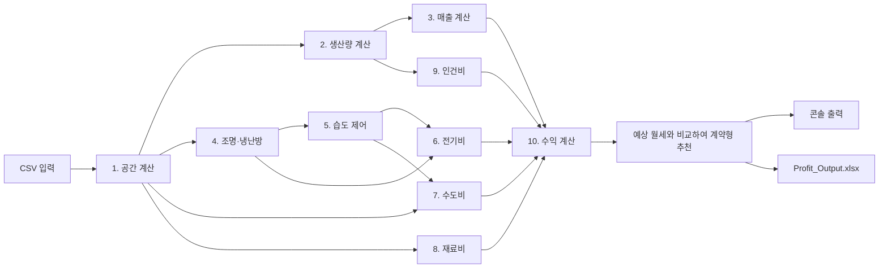

# Profit Calculator 1.0.1

실내농장 사업장의 공간·생산·매출·환경제어 에너지·운영비·수익을 월 단위로 계산하는 Python 콘솔 프로그램입니다.

원본 계산 다이어그램을 10개의 독립 계산 블록으로 나누었으며, `main.py`가 CSV 입력을 읽고 각 블록을 순서대로 실행합니다. 현재 버전은 부산의 3개 공간과 상추·딸기·바질·애플민트·쪽파·병풀을 모든 조합으로 연결하여 총 18개(3×6) 시나리오를 비교합니다. 결과는 콘솔과 `output/Profit_Output.xlsx`에서 확인할 수 있습니다.

## 주요 기능

- 공실 면적과 다단 재배 모듈을 반영한 재배면적 계산
- 작물별 생산량, 상품화율, 판매가격을 반영한 월 매출 계산
- 12개월 외기온도·상대습도에 따른 조명·난방·냉방 전력량 계산
- 증발산, 환기, 냉방 제습을 반영한 가습·제습 전력량 계산
- 조명·냉난방·가습·제습을 모두 포함한 월평균 전력비 계산
- 작물 공통 배액률과 공실 전체면적 기준 기타 용수를 반영한 수도비 계산
- 연 4회 구매 기준의 월 환산 모종비와 배액 포함 작물 관수량 기준 양액비 계산
- 최저시급 기준 인건비와 사용가능 바닥면적 기준 기기 대여비를 포함한 월 운영비·월 영업이익 계산
- 월 영업이익의 80%인 공간 대여자 예상수익과 사업 영업이익 계산
- 공간 대여자 예상수익과 원하는 월세를 비교한 장기·단기 계약형 추천
- 동일 공간에서 6개 작물을 비교하는 3×6 시나리오 계산
- 콘솔과 Excel에서 동일한 계산 결과를 출력하고, Excel에서 비용별 운영비 구성비 제공

Excel 출력에는 `openpyxl`이 필요합니다. 필요한 패키지는 `requirements.txt`에서 한 번에 설치할 수 있습니다.

## 전체 계산 흐름



## 프로젝트 구조

```text
Profit_Calculator 1.0.1/
├─ main.py
├─ console_output.py
├─ excel_output.py
├─ space_calculation.py
├─ production_calculation.py
├─ sales_calculation.py
├─ lighting_hvac_calculation.py
├─ humidity_calculation.py
├─ electricity_cost_calculation.py
├─ water_cost_calculation.py
├─ material_cost_calculation.py
├─ labor_cost_calculation.py
├─ profit_calculation.py
├─ requirements.txt
├─ README.md
├─ data/
   ├─ space_info.csv
   ├─ crop_production_info.csv
   ├─ crop_sale_info.csv
   ├─ electric_standard_info.csv
   ├─ standard_info.csv
   ├─ contraction_info.csv
   └─ monthly_environment.csv
└─ output/
   └─ Profit_Output.xlsx
```

Python 파일은 계산 블록 10개, 공통 실행 파일 1개와 출력 파일 2개로 구성됩니다.

| 파일 | 역할 |
|---|---|
| `space_calculation.py` | 공간과 재배면적 계산 |
| `production_calculation.py` | 월 생산량과 판매량 계산 |
| `sales_calculation.py` | 월 매출 계산 |
| `lighting_hvac_calculation.py` | 조명·난방·냉방 전력량 계산 |
| `humidity_calculation.py` | 환기·증발산·냉방제습과 가습·제습 전력량 계산 |
| `electricity_cost_calculation.py` | 환경제어 전력량 합산, 월평균, 전기비 계산 |
| `water_cost_calculation.py` | 배액을 포함한 월 용수량과 수도비 계산 |
| `material_cost_calculation.py` | 월 환산 모종비와 양액 사용량·양액비 계산 |
| `labor_cost_calculation.py` | 최저시급 기준 월 인건비 계산 |
| `profit_calculation.py` | 기기 대여비·운영비·영업이익·공간 대여자 예상수익·사업 영업이익·추천 방식 계산 |
| `main.py` | CSV 로딩, 3개 공간×6개 작물 계산 순서 제어, Excel 생성과 콘솔 출력 |
| `console_output.py` | 기존 1~10번 계산 블록 형식을 유지한 18개 시나리오 출력 |
| `excel_output.py` | 계산 결과를 `output/Profit_Output.xlsx`에 저장 |

## 실행 환경과 방법

Python 3.10 이상을 권장합니다.

처음 실행할 때 필요한 라이브러리를 설치합니다.

```powershell
python -m pip install -r requirements.txt
```

### 콘솔 출력

```powershell
cd "Profit_Calculator 1.0.1"
python main.py
```

`main.py`를 실행하면 각 사업장에 대해 다음 결과가 콘솔에 출력됩니다.

1. 공간 계산 결과
2. 생산량과 판매량
3. 월 매출
4. 조명·냉난방 전력량
5. 가습·제습 전력량
6. 월평균 총 전력량과 전기비
7. 작물 순소비량·배액량·기타 용수량과 수도비
8. 모종비·양액비와 재료비
9. 노동시간과 인건비
10. 사용가능 바닥면적 기준 기기 대여비·운영비·영업이익·공간 대여자 예상수익·사업 영업이익·추천 계약형
11. 12개월 환경제어 전력량 표
12. 18개 비교 시나리오의 참고용 합계

실행할 때마다 `output/Profit_Output.xlsx`도 새로 생성됩니다. Excel의 `요약` 시트에는 사용가능 바닥면적과 월 기기 대여비가 표시되며, `비용구성` 시트에는 전기비·수도비·재료비·인건비·기기 대여비·기타비용의 금액과 월 운영비 대비 비율이 표시됩니다. 같은 공간의 여섯 작물은 동시에 운영되는 합계가 아니라 서로 대체 가능한 비교안이므로, 콘솔의 18개 시나리오 합계는 비교 참고용입니다.

## CSV 입력 데이터

CSV 파일은 모두 UTF-8 형식으로 읽습니다. 코드에 직접 값을 넣는 대신 `data` 폴더의 CSV를 수정하여 입력과 상수를 바꿀 수 있습니다.

### `space_info.csv`

사업장과 공간 입력정보입니다. 각 공간 행은 모든 작물 정보와 조합되어 3×6 비교에 사용됩니다.

| 열 | 설명 | 단위 |
|---|---|---|
| `site_id` | 사업장 고유 ID | - |
| `site_name` | 사업장 표시 이름 | - |
| `total_area_m2` | 공실 전체면적 | m² |
| `cultivable_ratio` | 재배가능 비율 | 0~1 |
| `ceiling_height_m` | 공실 천장 높이 | m |
| `desired_monthly_rent_krw` | 공간 대여자가 원하는 월세 | 원/month |

현재 공간정보는 다음과 같으며, 각 공간은 CSV에 등록된 6개 작물 모두와 조합됩니다.

| 사업장 | 공실 전체면적 | 재배가능 비율 | 천장 높이 | 원하는 월세 |
|---|---:|---:|---:|---:|
| 부산 금정구 농장 | 164 m² | 0.65 | 2.5 m | 1,200,000원 |
| 부산 해운대 농장 | 66 m² | 0.65 | 2.5 m | 800,000원 |
| 부산 사하구 농장 | 324 m² | 0.65 | 2.5 m | 3,500,000원 |

### `crop_production_info.csv`

작물별 생산 및 환경 설정입니다.

| 열 | 설명 | 단위 |
|---|---|---|
| `crop_name` | 작물명 | - |
| `module_layers` | 작물에 적용할 재배모듈 층 수 | 층 |
| `yield_per_cycle_kg_m2` | 면적당 1회전 생산량 | kg/m²/cycle |
| `cycles_per_month` | 월 회전수 | cycle/month |
| `marketable_rate` | 상품화율 | 0~1 |
| `required_ppfd_umol_m2_s` | 면적당 필요 광량 | μmol/m²/s |
| `lighting_hours_day` | 하루 조명 점등시간 | hour/day |
| `target_temperature_c` | 목표 온도 | °C |
| `target_relative_humidity` | 목표 상대습도 | 0~1 |
| `daily_evapotranspiration_mm` | 일일 평균 증발산량 | mm/day |
| `seedling_cost_per_m2_month_krw` | 면적당 월 환산 모종비. 기존 1회 단가의 1/3 | 원/m²/month |

현재 작물별 모듈 층 수는 상추 4층, 딸기 2층, 바질 3층, 애플민트 4층, 쪽파 3층, 병풀 3층입니다. 동일한 공간에서도 선택한 작물의 층 수에 따라 재배면적과 이후 생산량·에너지·운영비·수익이 달라집니다.

모종비는 기존 면적당 1회 단가의 1/3을 월 환산 단가로 사용합니다. 이 월 환산 단가를 12개월 적용하면 기존 단가로 연 4회 모종을 구입하는 것과 같은 연간 비용이 됩니다. 생산량 계산의 작물별 월 회전수는 그대로 유지되며, 모종비 적용 횟수와 분리됩니다.

### `crop_sale_info.csv`

작물별 저장 판매가격입니다. 현재 버전에서는 외부 가격 API를 사용하지 않습니다.

| 열 | 설명 | 단위 |
|---|---|---|
| `crop_name` | 작물명 | - |
| `price_krw_kg` | 농산물 판매가격 | 원/kg |

### `electric_standard_info.csv`

조명과 벽체 열부하에 사용되는 기준값입니다.

- LED 광자효율: `2.8 μmol/J`
- 조명 발열 전환율: `0.95`
- 벽체 열관류율: `1.2 W/m²K`

### `standard_info.csv`

공기, 환기, 냉난방, 습도, 요금, 노동 관련 공통 기준값입니다.

주요 기본값은 다음과 같습니다.

| 항목 | 값 |
|---|---:|
| 공기 밀도 | 1.204 kg/m³ |
| 공기 정압비열 | 1005 J/kgK |
| 시간당 환기수 ACH | 0.125 회/hour |
| 냉난방 COP | 4.0 |
| 현열비 SHR | 0.75 |
| 대기압 | 101325 Pa |
| 건조공기 기체상수 | 287.05 J/kgK |
| 수증기 기체상수 | 461.5 J/kgK |
| 습도비 상수 | 0.622 |
| 20°C 기준 잠열 | 0.68153 kWh/kg |
| 제습 SEC | 0.5 kWh/kg |
| 가습 SEC | 0.07 kWh/kg |
| 기타 용수 | 0.2 L/m²/day |
| 배액률 | 0.3 (배액량 / 작물 관수량) |
| 수도 종합단가 | 2,300 원/m³ |
| 양액 단가 | 20 원/L |
| 전기 단일요율 | 155 원/kWh |
| 최저시급 | 10,320 원/hour |
| 생산량당 노동량 | 0.5 hour/kg |
| 면적당 월 기기 대여비 | 22,000 원/m²/month |
| 기타비용 | 300,000 원/month |

### `contraction_info.csv`

수익 배분비율입니다. 파일명은 원본 다이어그램의 명칭을 유지했습니다.

- 공간 대여자 배분비율: `0.8`

### `monthly_environment.csv`

1월부터 12월까지의 외기조건입니다.

| 열 | 설명 | 단위 |
|---|---|---|
| `month` | 월 표시값 | - |
| `outdoor_temperature_c` | 월별 외기온도 | °C |
| `outdoor_relative_humidity` | 월별 외기 상대습도 | 0~1 |

정상 실행을 위해 정확히 12개 행이 필요합니다. 현재 값은 서울권을 가정한 임시 샘플입니다.

## 계산 공식

### 1. 공간 계산

입력:

- 공실 전체면적 $A_{total}$
- 재배가능 비율 $R_{usable}$
- 작물별 재배모듈 층 수 $N_{layer}$ (`crop_production_info.csv` 입력)
- 천장 높이 $H$

사용가능 바닥면적:

```math
A_{floor}=A_{total}\times R_{usable}
```

다단 재배면적:

```math
A_{grow}=A_{floor}\times N_{layer}
```

공간 체적:

```math
V=A_{total}\times H
```

공간을 정사각형으로 가정한 공간 길이와 벽 한 면의 면적:

```math
L=\sqrt{A_{total}}
```

```math
A_{wall}=L\times H
```

출력은 사용가능 바닥면적, 재배면적, 공간 체적, 공간 길이, 벽 한 면의 면적입니다.

### 2. 생산량과 판매량 계산

면적당 월 생산량:

```math
Y_{month,m^2}=Y_{cycle,m^2}\times N_{cycle}
```

월 총생산량:

```math
M_{production}=A_{grow}\times Y_{month,m^2}
```

상품화율을 적용한 월 판매량:

```math
M_{sale}=M_{production}\times R_{marketable}
```

현재 모든 샘플 작물의 상품화율은 `0.9`입니다.

### 3. 매출 계산

```math
Revenue=M_{sale}\times Price_{crop}
```

현재 판매가격은 `crop_sale_info.csv`의 저장값을 사용합니다.

### 4. 조명과 냉난방 전력량 계산

#### 조명

필요 조명 전력:

```math
P_{light}
=
\frac{A_{grow}\times PPFD_{required}}
{Efficiency_{LED}}
```

평균 월 일수는 다음과 같이 사용합니다.

```math
D_{month}=\frac{365}{12}
```

월 점등시간과 소등시간:

```math
t_{on}=LightHours_{day}\times D_{month}
```

```math
t_{off}=(24-LightHours_{day})\times D_{month}
```

월 조명 전력량:

```math
E_{light}=\frac{P_{light}\times t_{on}}{1000}
```

조명에서 실내로 유입되는 열:

```math
Q_{light}=P_{light}\times R_{heat}
```

#### 벽체 열부하

```math
\Delta T=T_{target}-T_{outside}
```

외부에 노출된 벽면을 2개로 가정합니다.

```math
Q_{wall}=\Delta T\times A_{wall}\times U_{wall}\times2
```

#### 환기 열부하

```math
Q_{vent}
=
\frac{
\Delta T\times V\times\rho_{air}\times C_{p,air}\times ACH
}{3600}
```

공간 유지 열부하:

```math
Q_{maintain}=Q_{wall}+Q_{vent}
```

- $Q_{maintain}>0$: 난방이 필요한 상태
- $Q_{maintain}<0$: 냉방이 필요한 상태

#### 점등·소등 상태별 부하 분리

점등 중:

```math
Q_{heat,on}=\max(Q_{maintain}-Q_{light},0)
```

```math
Q_{cool,on}=\max(Q_{light}-Q_{maintain},0)
```

소등 중:

```math
Q_{heat,off}=\max(Q_{maintain},0)
```

```math
Q_{cool,off}=\max(-Q_{maintain},0)
```

월 난방 전력량:

```math
E_{heat}
=
\frac{
Q_{heat,on}t_{on}+Q_{heat,off}t_{off}
}{COP_{heat}\times1000}
```

월 냉방 전력량:

```math
E_{cool}
=
\frac{
Q_{cool,on}t_{on}+Q_{cool,off}t_{off}
}{SHR\times COP_{cool}\times1000}
```

습도 계산으로 전달되는 월 현열 냉방량:

```math
Q_{sens,month}=E_{cool}\times SHR\times COP_{cool}
```

이 계산은 `monthly_environment.csv`의 외기온도에 따라 12개월 각각 수행됩니다.

### 5. 습도 제어 전력량 계산

#### 작물 증발산량

`1 mm × 1 m² = 1 L = 1 kg`으로 처리합니다.

```math
M_{crop}
=
A_{grow}\times ET_{daily}\times\frac{365}{12}
```

#### 목표 습도비

마그누스 근사식으로 목표온도의 포화수증기압을 계산합니다.

```math
P_{sat,target}
=
610.94\exp\left(
\frac{17.625T_{target}}
{T_{target}+243.04}
\right)
```

```math
P_{v,target}=RH_{target}P_{sat,target}
```

```math
w_{target}
=
0.622\frac{P_{v,target}}
{P_{atm}-P_{v,target}}
```

#### 외기 습도비

```math
P_{sat,out}
=
610.94\exp\left(
\frac{17.625T_{out}}
{T_{out}+243.04}
\right)
```

```math
P_{v,out}=RH_{out}P_{sat,out}
```

```math
w_{out}
=
0.622\frac{P_{v,out}}
{P_{atm}-P_{v,out}}
```

외기 건조공기 밀도:

```math
\rho_{da,out}
=
\frac{P_{atm}-P_{v,out}}
{287.05(T_{out}+273.15)}
```

#### 환기에 의한 수분 유입·배출

월 환기 건조공기 질량:

```math
M_{da,month}
=
V\times ACH\times\rho_{da,out}
\times24\times\frac{365}{12}
```

환기에 따른 월 수분 변화:

```math
M_{vent}=M_{da,month}(w_{out}-w_{target})
```

- $M_{vent}>0$: 환기로 수분 유입
- $M_{vent}<0$: 환기로 수분 배출

월 기본 순수분량:

```math
M_{base}=M_{crop}+M_{vent}
```

#### 냉방에 의한 제습

```math
Q_{latent}=Q_{sens}\frac{1-SHR}{SHR}
```

```math
M_{cool}=\frac{Q_{latent}}{h_{fg}}
```

냉방제습 후 잔여 수분량:

```math
M_{remain}=M_{base}-M_{cool}
```

#### 별도 가습·제습 전력

```math
E_{dehumid}
=
\max(0,M_{remain})\times SEC_{dehumid}
```

```math
E_{humid}
=
\max(0,-M_{remain})\times SEC_{humid}
```

잔여 수분이 양수이면 제습하고, 음수이면 가습합니다.

### 6. 전기비 계산

원본 다이어그램에서 연결이 누락된 월 조명 전력량도 총 전력량에 포함합니다.

월별 총 환경제어 전력량:

```math
E_{environment,m}
=
E_{light}
+E_{heat,m}
+E_{cool,m}
+E_{dehumid,m}
+E_{humid,m}
```

12개월 결과를 산술평균하여 월평균 소모량으로 환산합니다.

```math
E_{average,month}
=
\frac{1}{12}
\sum_{m=1}^{12}E_{environment,m}
```

단일요율 전기비:

```math
ElectricCost
=
E_{average,month}\times155
```

### 7. 수도비 계산

작물의 월 증발산량을 작물이 실제로 소비한 순용수량으로 봅니다. 모든 작물에 동일한 배액률 `0.3`을 적용하며, 배액을 포함한 작물 관수량은 순용수량을 `1 - 배액률`로 나누어 계산합니다.

```math
r_{drain}
=
\frac{W_{drain,L}}{W_{crop,irrigation,L}}
=0.3
```

```math
W_{crop,irrigation,L}
=
\frac{W_{crop,L}}{1-r_{drain}}
```

월 배액량:

```math
W_{drain,L}
=
W_{crop,irrigation,L}-W_{crop,L}
```

기타 용수는 재배면적이 아닌 공실 전체면적을 기준으로 계산합니다.

```math
W_{other,L}
=
A_{total}\times0.2\times\frac{365}{12}
```

월 총 용수량:

```math
W_{total,m^3}
=
\frac{W_{crop,irrigation,L}+W_{other,L}}{1000}
=
\frac{\dfrac{W_{crop,L}}{1-r_{drain}}+W_{other,L}}{1000}
```

수도비:

```math
WaterCost=W_{total,m^3}\times2{,}300
```

### 8. 재료비 계산

월 모종비는 기존 1회 단가를 3으로 나눈 월 환산 단가를 사용합니다.

```math
SeedlingRate_{m^2,month}
=
\frac{SeedlingPrice_{m^2,once}}{3}
```

따라서 12개월 누적 모종비는 기존 단가를 연 4회 적용한 금액과 같습니다.

```math
AnnualSeedlingCost
=
A_{grow}\times SeedlingRate_{m^2,month}\times12
=
A_{grow}\times SeedlingPrice_{m^2,once}\times4
```

월 모종비:

```math
SeedlingCost
=
A_{grow}\times SeedlingRate_{m^2,month}
```

월 양액량은 수도비 단계에서 배액률을 반영해 계산한 월 작물 관수량을 그대로 사용합니다. 공실 전체면적 기준 기타 용수는 양액량에 포함하지 않습니다.

```math
NutrientVolume_L
=
W_{crop,irrigation,L}
```

월 양액비:

```math
NutrientCost
=
NutrientVolume_L\times20
```

총 재료비:

```math
MaterialCost=SeedlingCost+NutrientCost
```

### 9. 인건비 계산

상품화 이후의 판매량을 상품화 이전 생산량으로 역산합니다.

```math
M_{production}
=
\frac{M_{sale}}{R_{marketable}}
```

```math
LaborHours=M_{production}\times0.5
```

```math
LaborCost=LaborHours\times10{,}320
```

### 10. 수익 계산

#### 공통 기초비용

```math
BaseCost
=
ElectricCost+WaterCost+MaterialCost+EquipmentRentalCost
```

월 기기 대여비는 다단 재배면적이 아닌 사용가능 바닥면적을 기준으로 계산합니다.

```math
EquipmentRentalCost
=
AvailableFloorArea\times22{,}000
```

기타비용은 모든 시나리오에 월 `300,000원`을 공통 적용합니다.

#### 월 운영비와 월 영업이익

```math
OperatingCost
=
BaseCost+LaborCost+OtherCost
```

```math
OperatingProfit
=
Revenue-OperatingCost
```

#### 공간 대여자와 사업 영업이익

공간 대여자 배분비율은 `contraction_info.csv`의 현재 값 `0.8`을 사용합니다.

```math
LandlordIncome
=
OperatingProfit\times0.8
```

```math
BusinessProfit
=
OperatingProfit-LandlordIncome
```

공간 대여자 예상수익과 원하는 월세의 차이는 다음과 같습니다.

```math
RentDifference
=
LandlordIncome-DesiredMonthlyRent
```

#### 추천 방식

- 월 영업이익이 음수이면 음수 결과를 그대로 출력하고 `개인취미 대여 방식(단기계약형)`을 추천합니다.
- 월 영업이익이 0 이상이고 공간 대여자 예상수익이 원하는 월세 이상이면 `도심형 대량생산 스마트팜 방식(장기계약형)`을 추천합니다.
- 나머지는 `개인취미 대여 방식(단기계약형)`을 추천합니다.
- 두 금액이 같은 경우에는 장기계약형을 추천합니다.

면적당 월 기기 대여비는 모든 시나리오의 운영비로 반영합니다. 단기계약형의 중개수수료·AS 수익 등 별도 사업모델 수익은 아직 계산하지 않으며, 현재 버전에서는 추천 결과만 제공합니다.

## 계산 단위와 주요 가정

- 질량은 kg, 길이는 m, 시간은 second 또는 hour를 수식에 맞게 사용합니다.
- 평균 한 달은 `365 / 12일`로 계산합니다.
- 공간 바닥은 정사각형으로 가정하여 한 변의 길이를 구합니다.
- 외부에 노출된 벽은 두 면으로 가정합니다.
- 현재 세 공간의 천장 높이 입력값은 2.5 m입니다.
- 재배가능 비율은 현재 세 공간 모두 `0.65`를 적용합니다.
- 모듈 층 수는 공간이 아니라 작물별 입력값을 사용하며, 현재 상추 4층·딸기 2층·바질 3층·애플민트 4층·쪽파 3층·병풀 3층입니다.
- `1 mm × 1 m² = 1 L = 1 kg`으로 증발산량을 변환합니다.
- 전기비는 단일요율, 수도비는 `2,300원/m³`의 종합단가로 계산합니다.
- 배액률은 `standard_info.csv`의 공통값 `0.3`을 사용하며 모든 작물에 동일하게 적용합니다.
- 양액 단가는 `20원/L`이며, 월 양액량은 배액을 포함한 월 작물 관수량과 같습니다. 기타 용수는 양액량에서 제외합니다.
- 외기조건은 12개월별로 계산한 후 총 전력량을 산술평균합니다.
- 계산은 내부적으로 실수 정밀도를 유지합니다. 콘솔에서는 원화를 `3,421원`, 전력량을 `12,014 kWh`처럼 각각 정수로 일반 반올림하여 표시하며, Excel은 원래 계산값을 보존한 채 셀 표시 형식을 적용합니다.
- 적자가 발생하면 배분 수익도 음수로 표시합니다. 별도의 `max(0, profit)` 처리는 하지 않습니다.
- 공간정보는 부산 금정구·해운대·사하구의 현재 입력값을 사용합니다. 월별 외기조건은 아직 서울권을 가정한 임시 샘플이며, 작물 생산정보와 판매가격은 사용자가 입력한 현재 기준값입니다.

## 데이터 수정 방법

### 새 사업장 추가

`data/space_info.csv`에 새 행을 추가합니다. 추가한 공간은 등록된 모든 작물과 자동으로 조합되며, `desired_monthly_rent_krw`도 함께 입력해야 합니다.

### 새 작물 추가

동일한 `crop_name`으로 다음 두 파일에 행을 추가합니다.

- `data/crop_production_info.csv`
- `data/crop_sale_info.csv`

둘 중 하나라도 누락되면 실행 시 작물 정보 오류가 발생합니다. `crop_production_info.csv`에는 해당 작물의 `module_layers`도 0보다 큰 값으로 입력해야 합니다.

### 공통 상수 또는 요금 변경

- 조명효율·발열률·벽체 열관류율: `electric_standard_info.csv`
- 공기·환기·냉난방·습도·요금·인건비·면적당 월 기기 대여비: `standard_info.csv`
- 수익 배분비율: `contraction_info.csv`
- 월별 외기조건: `monthly_environment.csv`

`key` 이름은 코드에서 직접 참조하므로 변경하지 말고 `value`만 수정하는 것을 권장합니다.

## 현재 입력 실행 기준

제공된 CSV를 변경하지 않고 실행하면 3개 공간×6개 작물, 총 18개 시나리오가 생성됩니다.

| 공간 | 상추 | 딸기 | 바질 | 애플민트 | 쪽파 | 병풀 |
|---|---|---|---|---|---|---|
| 부산 금정구 농장 | 단기계약형 | 장기계약형 | 장기계약형 | 장기계약형 | 단기계약형 | 단기계약형 |
| 부산 해운대 농장 | 단기계약형 | 장기계약형 | 장기계약형 | 장기계약형 | 단기계약형 | 단기계약형 |
| 부산 사하구 농장 | 단기계약형 | 장기계약형 | 장기계약형 | 장기계약형 | 단기계약형 | 단기계약형 |

현재 입력 기준 추천 결과는 장기계약형 9개, 단기계약형 9개입니다. 음수 수익은 계산 오류가 아니라 설정된 생산량·판매가격·인건비·전력비·기기 대여비 조합에 따른 결과이며, 18개 합계는 같은 공간의 대체 작물 시나리오까지 더한 비교 참고값입니다.

## 현재 범위

현재 버전은 계산식을 쉽게 수정하고 다른 언어 구현의 기준으로 사용할 수 있는 로컬 CSV 입력, 콘솔·Excel 출력에 집중합니다. 다음 기능은 아직 포함하지 않습니다.

- 실시간 농산물 가격 API 연동
- 외부 서버를 통한 다중 사용자 웹 서비스
- 데이터베이스 저장
- 사용자의 수익 선호도를 반영하는 추천 알고리즘
- 단기계약형 중개·AS 수익과 유지보수 비용의 상세 계산
- 실제 계약전력·누진제·기본요금을 반영한 전기요금제
- 월별 일수 차이와 윤년 처리
- 장비별 세부 감가상각 모델

이 기능들은 계산 블록을 유지한 채 입력 또는 출력 계층을 확장하는 방식으로 추가할 수 있습니다.
