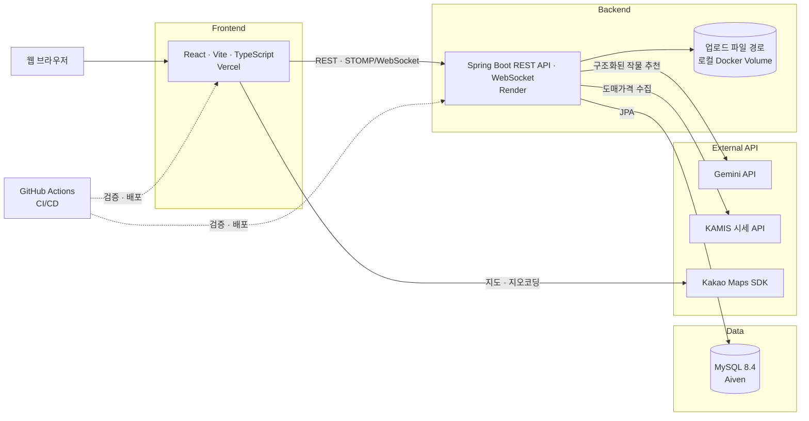
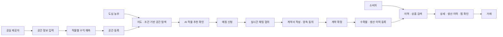

# 🌱 FarmBroker

<p align="center">
  <a href="https://pnuai-b-06-bomdongmarket.vercel.app" title="FarmBroker 배포 서비스">
    
  </a>
  <br/>
  <a href="https://pnuai-b-06-bomdongmarket.vercel.app" title="FarmBroker 배포 서비스">
    
  </a>
</p>

> **직방형 스마트팜 중개 플랫폼**
> 도심 유휴공간을 스마트팜으로 전환하여 공실 제공자 · 도심 농부 · 소비자 3자를 하나의 웹 플랫폼으로 연결합니다.

**제7회 PNU 창의융합 AI 해커톤 · 지정과제트랙**

<br/>

## 1. 프로젝트 소개

### 1.1. 개발배경 및 필요성

도심 공실 증가는 자산 가치와 지역 상권에 부담을 줍니다. 농산물의 장거리 운송은 유통 비용과 푸드 마일리지를 높이고 신선도를 낮춥니다.

스마트팜은 공간, 전문 지식, 초기 비용, 수익성 검토가 필요해 개인이 시작하기 어렵습니다. FarmBroker는 도심 유휴공간, 예비 농부, 지역 소비자를 연결해 이 문제를 함께 해결합니다.
<br/>

### 1.2. 개발 목표 및 주요 내용

공간의 경제성을 먼저 검토한 뒤 매칭·계약·생산 이력·지역 거래까지 연결하는 **생활권 기반 스마트팜 플랫폼**을 구축합니다.
<br/>

### 1.3. 세부내용

**[사용자 요구사항]**

|   사용자    | 주요 기능                                                      |
| :---------: | :------------------------------------------------------------- |
| 공실 제공자 | 공간 등록 전 수익 예측, 신청 확인, 채팅 협의, 계약서 작성·동의 |
|  도심 농부  | 지도·조건 기반 공간 탐색, AI 작물 추천, 매칭 신청, 채팅·계약   |
|   소비자    | 지역 농산물 검색, 생산 이력 조회, 찜, 거래 확정                |

**[기능 요구사항]**

- **회원·인증** — 이메일 회원가입·로그인, httpOnly JWT 쿠키, 다중 역할 관리
- **공간·수익** — 공간 CRUD, 이미지 업로드, 카카오 지도 검색, CSV 기준 수익 계산
- **추천·매칭** — Gemini 작물 추천, 매칭 신청, 실시간 채팅, 양측 계약 동의
- **로컬 마켓** — 상품·생산 이력 CRUD, 위치 검색, 찜, 주문 기록과 재고 차감
  <br/>

### 1.4. 기존 서비스 대비 차별성

**(1) 진입 장벽의 완화**

- 기존: 공간 확보, 설비 조건, 예상 수익을 각각 검토해야 함
- FarmBroker: 유휴공간 탐색, 수익 예측, 작물 추천, 계약을 한 흐름으로 연결

**(2) 농산물 직거래**

- 기존: 생산지와 생산 과정을 확인하기 어려움
- FarmBroker: 지도 기반 로컬 마켓에서 생산 위치와 단계별 생산 이력을 함께 제공
  <br/>

### 1.5. 사회적가치 도입 계획

1. **건물주·부동산 관리자** — 유휴공간의 활용 가능성과 예상 수익을 확인
2. **창업자·부업 희망자** — 토지 매입 없이 도심 공간을 찾아 농업 진입 비용을 낮춤
3. **지역 소비자·공동체** — 가까운 생산지의 농산물과 생산 이력을 확인
4. **기업·공공기관** — 공실 문제와 지역 생산·소비를 연결하는 도시 재생 모델로 활용
   <br/>

## 2. 상세설계

### 2.1. 시스템 구성도



<br/>

### 2.2. 사용 기술

##### Frontend


<details>
  <summary>기타 프론트엔드 기술</summary>
  <p><code>React Router 7.18.1</code> <code>STOMP.js 7.3.0</code> <code>Vitest 3.2.6</code> <code>Testing Library 16.3.2</code> <code>Kakao Maps SDK</code></p>
</details>

##### Backend & Database


<details>
  <summary>기타 백엔드 기술</summary>
  <p><code>Spring Security 7.1.0</code> <code>Spring Data JPA 4.1.0</code> <code>JJWT 0.12.6</code> <code>springdoc-openapi 3.0.3</code> <code>WebSocket</code></p>
</details>

##### AI & External API


##### Infrastructure


AI 코딩 도구의 단계별 활용 내용과 검증 결과는 [AI 도구 활용](#35-ai-도구-활용)에 정리했습니다.
<br/>

## 3. 개발결과

### 3.1. 전체시스템 흐름도



<br/>

### 3.2. 기능설명

##### `로그인 / 회원가입 페이지`


- 이메일 형식, 8자 이상 비밀번호와 확인값, 2~30자 닉네임을 입력 단계에서 검증합니다.
- 서버는 비밀번호를 BCrypt로 저장하고 JWT Access Token을 httpOnly 쿠키로 발급합니다. 프론트엔드는 쿠키를 직접 읽지 않고 로그인 상태만 복원합니다.
- 신규 회원은 소비자 역할로 시작합니다. 공간 등록 시 공간 제공자, 계약 확정 시 농부 역할이 누적되어 한 계정으로 여러 기능을 사용할 수 있습니다.

##### `공간 등록 페이지 (공실 제공자)`


- 주소, 면적, 월세, 층수, 급수·전기·환기 설비, 설명과 이미지를 입력합니다. 주소는 카카오 지오코딩으로 좌표를 저장합니다.
- 등록 전에 작물별 재배면적·전력량·생산량·매출을 계산합니다. 전기·수도·모종·양액·인건비·장비 대여비를 포함한 운영비와 배분수익도 함께 제공합니다.
- 영업 손실 여부와 추천 계약 형태를 확인한 뒤 등록을 확정합니다. 등록된 공간은 지도 반경, 면적, 월세 조건으로 탐색할 수 있습니다.

##### `매칭 페이지 (도심 농부)`


- 공간 상세에서 서버 수익 계산기가 정한 작물 순위와 Gemini가 작성한 추천 근거를 함께 확인합니다.
- 매칭 유형과 메시지로 신청합니다. 본인 공간 신청, 중복 신청, 차단 사용자 간 신청은 서버에서 제한하며 신청 내역과 알림은 대시보드에서 관리합니다.
- 당사자는 텍스트·이미지 채팅으로 조건을 협의합니다. 공간 제공자가 월세·관리비·보증금·기간을 작성하고 양측이 같은 계약 버전에 동의해야 계약이 확정됩니다.
- 계약이 확정되면 공간은 매칭 완료 상태로 바뀌고 신청자에게 농부 역할이 추가됩니다. 같은 공간의 나머지 신청은 자동 종료됩니다.

##### `직거래 마켓 페이지 (소비자)`


- 주소·반경·키워드·카테고리로 가까운 상품을 검색하고 지도 마커와 같은 결과 목록을 확인합니다.
- 상품 상세에서 생산 위치, 수확일, 단계별 생산 이력과 재고를 확인하고 찜 목록에 저장할 수 있습니다. 판매자는 상품과 생산 이력을 등록·수정·종료합니다.
- 데모 범위에는 실제 PG 결제가 없습니다. 거래 확정 시 주문을 기록하고 잠금 처리된 재고를 차감하며, 재고가 0이면 판매를 자동 종료합니다.
  <br/>

### 3.3. 기능명세서

|  도메인   | 주요 API                                                 | 권한·핵심 규칙                                                       |
| :-------: | :------------------------------------------------------- | :------------------------------------------------------------------- |
|   회원    | `POST /auth/signup`, `POST /auth/login`, `/users/me`     | 가입·로그인은 공개. 내 정보 조회·수정·탈퇴는 인증 필요               |
| 공간·추천 | `/spaces`, `POST /profit/estimate`, `POST /ai/recommend` | 공간 목록·상세는 공개. 등록·수익 예측·AI 추천은 인증 필요            |
| 매칭·계약 | `/matchings`, `/matchings/{id}/contract`                 | 모든 요청은 인증 필요. 계약서는 공간 제공자와 신청자만 접근          |
|   채팅    | `/chat/conversations`, `/ws-chat`                        | 대화 참여자만 메시지·이미지·읽음 상태에 접근. STOMP 실시간 알림 제공 |
| 마켓·주문 | `/products`, `/wishlist`, `POST /orders`                 | 상품 목록·상세는 공개. 쓰기·찜·거래 확정은 인증 필요                 |

- **API 명세** — 서버 실행 후 [Swagger UI](http://localhost:8080/api/swagger-ui.html)에서 확인
- **설계 명세** — [`docs/specs`](docs/specs)에 인증, 로컬 마켓, 지도 검색 설계를 기록
- **구현 계획** — [`docs/plans`](docs/plans)에 작업 단위, 실패 테스트, 검증 명령을 기록
- **공통 계약** — [`farmbroker/AGENT.md`](farmbroker/AGENT.md)에 응답 형식, 인증, 도메인 경계를 기록
  <br/>

### 3.4. 디렉토리 구조

```
FarmBroker/
├── .agents/               # 프론트엔드 작업용 Agent Skill
├── .github/               # PR 템플릿과 Frontend/Backend CI·CD
├── farmbroker-web/        # React + Vite + TypeScript 프론트엔드
│   └── src/
│       ├── api/           # REST API 클라이언트
│       ├── auth/          # 인증 상태와 라우트 보호
│       ├── chat/          # STOMP/WebSocket 연결
│       ├── components/    # 공통 UI·레이아웃·지도
│       ├── pages/         # 인증·공간·계약·채팅·마켓 화면
│       └── services/      # 도메인별 API 연동
├── farmbroker/            # Spring Boot 백엔드
│   └── src/main/java/com/farmbroker/farmbroker/
│       ├── auth/ user/ security/    # 회원·JWT 인증
│       ├── space/ matching/ chat/   # 공간·매칭·계약·채팅
│       ├── ai/ crop/ profit/        # 추천·작물·수익 계산
│       ├── product/ order/          # 상품·생산 이력·찜·주문
│       └── file/ common/            # 파일·공통 응답·예외
├── Profit_Calculator 1.0.1/ # Python 수익 계산 원본과 기준데이터
├── db/                      # MySQL 초기화 안내
├── docs/
│   ├── specs/               # 상세 설계 명세
│   ├── plans/               # Agent 구현 계획
│   └── DESIGN_SYSTEM.md     # 디자인 시스템 문서
├── AGENTS.md                # 저장소 공통 Agent 하네스
├── docker-compose.yml       # 로컬 통합 실행
└── README.md
```

<br/>

### 3.5. AI 도구 활용

|      단계      |              방식              | 적용 내용                                                                                                                                                                      |
| :------------: | :----------------------------: | :----------------------------------------------------------------------------------------------------------------------------------------------------------------------------- |
|    TDD·리뷰    | Claude Code Superpowers Plugin | 실패 테스트 작성, 최소 구현, 전체 검증 순으로 개발. superpowers reviewer로 PR 변경 범위와 회귀 위험 검토                                                                       |
|   병렬 개발    |        Subagent-Driven         | 작업 단위별 Agent를 병렬로 운용하고 각 Agent가 읽을 참조 문서와 소유 범위를 지정                                                                                               |
|  세션 일관성   |     `AGENTS.md`·`AGENT.md`     | 루트·프론트엔드·백엔드 지침을 분리. 세션이 바뀌어도 명명, 구조, 검증, 보안 규칙을 유지                                                                                         |
| 디자인 일관성  |      프로젝트 전용 Skills      | 디자인 시스템 구축·UI 일관성 Skill을 직접 제작·적용. 토큰, 공통 컴포넌트, 접근성, 반응형과 상태 화면 규칙을 문서·검증 스크립트로 통일                                          |
| Spec 기반 개발 |   `docs/specs`·`docs/plans`    | 상세 설계를 먼저 작성·검토한 뒤 구현 계획을 테스트와 검증 명령 단위로 분해해 실행                                                                                              |
|  공통 하네스   |       Karpathy 기반 지침       | [약 20.6만 Star의 공개 지침](https://github.com/multica-ai/andrej-karpathy-skills)을 프로젝트에 맞게 수정. 가정 명시, 단순성, 최소 변경, 검증 가능한 목표를 공통 규칙으로 적용 |
|   서비스 AI    |           Gemini API           | 서버 수익 계산기가 정한 작물 후보에 대해 구조화된 추천 근거를 생성. 응답 검증과 재시도·폴백 적용                                                                               |

근거 산출물은 프로젝트 전용 Skill 2개, 디자인 규격 문서 3개, 설계 명세 4개, 구현 계획 2개와 영역별 Agent 지침 3개입니다. 현재 저장소에는 백엔드 테스트 파일 44개와 프론트엔드 테스트 파일 55개가 있으며, GitHub Actions가 빌드·테스트를 다시 검증합니다.

제출 문서: [`docs/ai-usage.md`](docs/ai-usage.md)
<br/>

## 4. 설치 및 사용 방법

**필요 패키지**

- Docker Desktop 또는 Node.js 22, JDK 21, MySQL 8.4

```bash
# 0. 저장소 클론 및 환경변수 설정
git clone https://github.com/PNU-2026-AI-Hackathon/pnuai-b-06-bomdongmarket.git
cd pnuai-b-06-bomdongmarket
cp .env.example .env
# .env의 DB_PASSWORD, JWT_SECRET, GEMINI_API_KEY 등을 입력

# 1. 전체 실행 (Docker Compose — MySQL + 백엔드 + 프론트)
docker compose up --build -d
# 프론트: http://localhost:5173
# API: http://localhost:8080/api
# Swagger: http://localhost:8080/api/swagger-ui.html

# 개별 실행

# Frontend (React + Vite)
cd farmbroker-web
npm ci
npm run dev

# Backend (Spring Boot)
cd ../farmbroker
./gradlew bootRun
```

<br/>

## 5. 소개 및 시연영상

현재 저장소에는 소개 및 시연 영상 URL이 포함되어 있지 않습니다. 교육원 제출 후 부여받은 YouTube URL을 반영할 예정입니다.
<br/>

## 6. 팀 소개

|                                                                                                   강범수                                                                                                    |                                                                                                   변현빈                                                                                                    |                                                                                               강민규                                                                                                |                                                                                           문수호                                                                                            |                                                                                           이도헌                                                                                            |
| :---------------------------------------------------------------------------------------------------------------------------------------------------------------------------------------------------------: | :---------------------------------------------------------------------------------------------------------------------------------------------------------------------------------------------------------: | :-------------------------------------------------------------------------------------------------------------------------------------------------------------------------------------------------: | :-----------------------------------------------------------------------------------------------------------------------------------------------------------------------------------------: | :-----------------------------------------------------------------------------------------------------------------------------------------------------------------------------------------: |
| <a href="https://github.com/nitally0715"></a><br/><a href="https://github.com/nitally0715">@nitally0715</a> | <a href="https://github.com/hbin2010-26"></a><br/><a href="https://github.com/hbin2010-26">@hbin2010-26</a> | <a href="https://github.com/RainDrop3"></a><br/><a href="https://github.com/RainDrop3">@RainDrop3</a> | <a href="https://github.com/dib3474"></a><br/><a href="https://github.com/dib3474">@dib3474</a> | <a href="https://github.com/03leedo"></a><br/><a href="https://github.com/03leedo">@03leedo</a> |
|                                                                                            soseze1215@gmail.com                                                                                             |                                                                                             bini2432@naver.com                                                                                              |                                                                                        kanghy6220@gmail.com                                                                                         |                                                                                      dib3474@gmail.com                                                                                      |                                                                                     hero9573@naver.com                                                                                      |
|                                                                                         전체 총괄 <br/> Agentic AI                                                                                          |                                                                                           제품설계 <br/> 전략기획                                                                                           |                                                                                  백엔드 주 개발 <br/> 데이터 처리                                                                                   |                                                                               개발 총괄 <br/> 프로젝트 디버깅                                                                               |                                                                              프론트 주 개발 <br/> 백엔드 서브                                                                               |
|                                                                                              정보컴퓨터공학부                                                                                               |                                                                                                 기계공학부                                                                                                  |                                                                                          정보컴퓨터공학부                                                                                           |                                                                                      정보컴퓨터공학부                                                                                       |                                                                                      정보컴퓨터공학부                                                                                       |

**팀 보유역량**

- **강범수** — CIS Lab 학부연구생, Agentic AI 및 Claude Code 심층 탐구, ADsP 자격증 취득, AWS Cloud PBL 우수상(2위)
- **변현빈** — 기계공학 전공, CAD(Creo)·CAE(Ansys) 활용, 공학 경영 설계 경험
- **강민규** — 카카오테크캠퍼스 4기 Agentic AI 과정, PNU AI Booster 우수상(2위), 카카오테크캠퍼스 아이디어톤 우수상
- **문수호** — 카카오테크캠퍼스 3기 프론트엔드 과정 우수상(2위), SQLD 자격증 취득, AWS Cloud PBL 우수상(2위)
- **이도헌** — 카카오테크캠퍼스 4기 Agentic AI 과정, 카카오테크캠퍼스 아이디어톤 우수상

> 지도교수: 김태운 교수님 (정보컴퓨터공학부)
> <br/>

## 7. 해커톤 참여 후기

- **강범수**
  > PM으로서 여러파트에 관해 오지랖도 부리며 조언과 잔소리를 많이했는데 다 따라와주며 잘 들어줘서 이번 대회 동안 팀원들에게 너무 고마웠습니다.
  >
  > 마지막으로 약 450개의 commit과 60개의 issue 80개의 PR 그리고 총 18번의 회의 동안 많이 싸우고 울고 웃었지만 이를 통해 많이 배우며 자신감을 얻을 수 있는 좋은 경험이 되었습니다.
- **변현빈**
  > 해커톤을 진행하며 스마트팜의 환경제어 비용과 수익성 모델을 설계하고, 전공 지식을 실제 서비스에 적용해볼 수 있었습니다. 특히 팀원들이 AI를 활용해 코드를 작성하는 **바이브 코딩 방식**을 가까이에서 보며, AI를 개발 과정에서 어떻게 활용할 수 있는지 배울 수 있었습니다. 이전에는 AI를 코딩에 어떤 방식으로 활용해야 할지 막연했지만, 아이디어를 코드로 구체화하고 수정·보완해 나가는 과정을 직접 경험할 수 있었습니다. 또한 시장조사와 서비스 기획, 개발 과정에 함께 참여하며 하나의 아이디어가 실제 서비스 형태로 발전하는 과정을 이해할 수 있었으며, 이번 경험을 통해 새로운 개발 방식과 협업 과정을 배울 수 있어 의미 있는 경험이었습니다. 좋은 기회를 만들어준 우리 팀원에게 감사드립니다.
- **강민규**
  > 이번 해커톤을 통해 평소에 잘 몰랐던 스마트팜에 대해 공부하고 알아보며 스마트팜의 가치와 의의에 대해 깊게 생각해보는 시간을 가졌습니다. 현장학습을 통해 현직자분의 이야기도 듣고 피드백도 받으며 DRB의 고충과 추구하는 방향성을 듣고 제 진로를 고민하는 데에도 많은 도움이 되었습니다.
  >
  > 백엔드를 담당자로서 API설계, swagger 문서 구축, DB관리 등을 수행하며 백엔드 개발자의 역량과 역할에 대해 잘 알게 되었습니다. 또한 통합 하네스 문서 관리, ponytail과 같은 skill 사용, 도메인 별 상세 지침 적용, multi-agent를 활용한 정보 서치 등 단순히 “~해줘”와 같은 요청을 넘어서 AI를 적극적으로 활용했습니다. 이를 통해 AI 역량을 크게 키울 수 있었고 앞으로의 현업 시장에 AI가 얼마나 큰 영향을 끼칠지 패러다임에 대해서도 깊게 고민해보게 되었습니다.
- **문수호**
  > 초기 프론트엔드 구축부터 백엔드 API 연동, 디자인 시스템 정립, CI/CD 구성까지 서비스 전반을 직접 연결했습니다. 특히 지도 페이지의 재렌더링 루프, 한글 검색 멈춤 현상, 배포 오류 등 운영 과정의 트러블슈팅을 거치며 기능 구현만큼이나 안정적인 UX와 배포 환경이 중요하다는 것을 깨달았습니다.
  >
  > 또한 AI 도구를 단순히 코드를 생성하는 용도로 사용하는 데 그치지 않고 설계 문서와 작업 계획, 프로젝트별 Agent 지침, 테스트와 코드 리뷰를 결합한 개발 흐름을 만들어본 것이 가장 의미 있었습니다. 빠르게 구현하면서도 결과를 신뢰하려면 명확한 기준과 반복적인 검증이 반드시 필요하다는 것을 체감했습니다.
  >
  > 여러 팀원이 동시에 각자의 영역을 개발하는 과정에서 충돌을 조율하고 서로 다른 기능을 하나의 서비스로 완성해 나가는 일이 쉽지만은 않았지만 그만큼 기술과 협업 양쪽에서 크게 성장할 수 있었습니다. 긴 개발 과정 동안 함께 고민하고 끝까지 완성도를 높여 준 팀원들에게 감사하며 아이디어가 실제로 동작하는 서비스가 되는 전 과정을 경험할 수 있어 뜻깊었습니다.
- **이도헌**
  > 추후 작성 예정
  > <br/>
